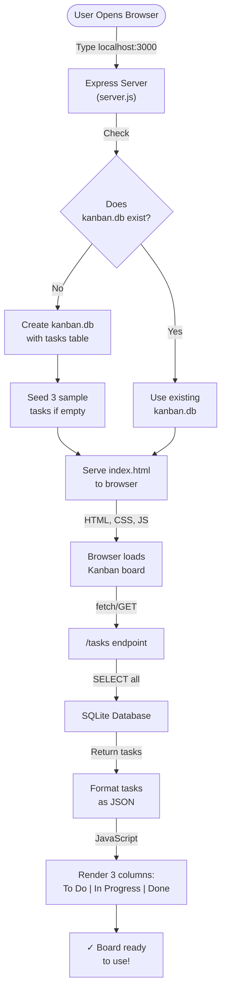
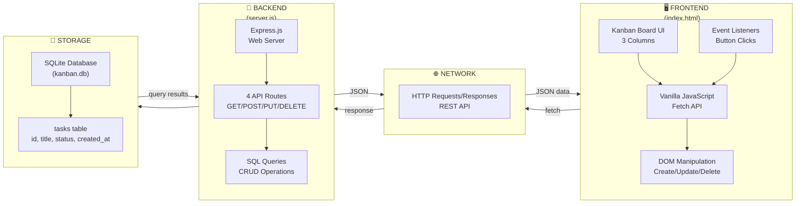
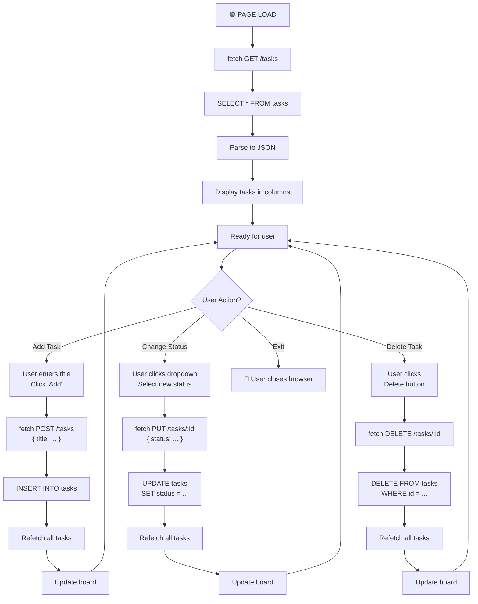
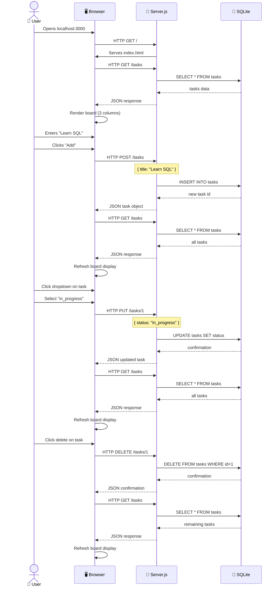
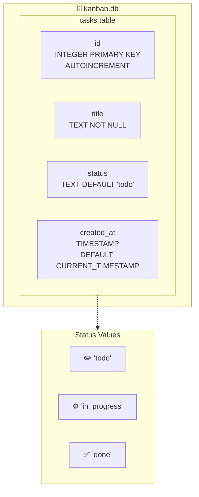
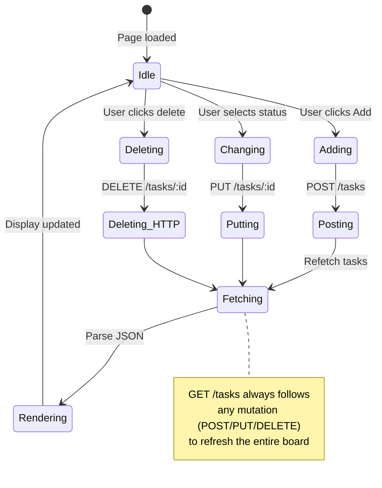

# Simple Kanban App - Complete Flow Infographic

This document provides visual diagrams explaining how the Simple Kanban App works from start to end.

## 🎬 Application Startup Flow



## 💻 System Architecture



## 📌 Complete User Interaction Flow



## 🔗 API Call Sequence



## 📊 Data Flow for "Add Task" Operation

```mermaid
graph LR
    A["👤 User Types<br/>Task Title"] --> B["📝 Input Field<br/>Value Captured"]
    B --> C["🖱️ Click Add Button"]
    C --> D["🔄 Event Listener<br/>Triggered"]
    D --> E["📦 Create JSON<br/>{ title: '...' }"]
    E --> F["🌐 fetch POST<br/>/tasks"]
    F --> G["📨 HTTP Request<br/>to Server"]
    G --> H["🔧 Express Route<br/>POST /tasks"]
    H --> I["💾 SQL Query<br/>INSERT INTO tasks"]
    I --> J["📂 Save to<br/>SQLite Database"]
    J --> K["📄 Return JSON<br/>New Task Object"]
    K --> L["🌐 HTTP Response<br/>to Browser"]
    L --> M["🔄 Call fetchTasks<br/>GET /tasks"]
    M --> N["📂 Query all<br/>from Database"]
    N --> O["📊 Group by<br/>Status"]
    O --> P["🎨 Render<br/>3 Columns"]
    P --> Q["✅ Display<br/>New Task"]
```



## 🗂️ Database Schema



## 🎯 Request/Response Examples

### 1️⃣ GET /tasks - Fetch All Tasks
```
REQUEST:
  GET http://localhost:3000/tasks

RESPONSE (200 OK):
{
  "tasks": [
    {
      "id": 1,
      "title": "Learn HTTP verbs",
      "status": "todo",
      "created_at": "2026-05-08T10:00:00Z"
    },
    {
      "id": 2,
      "title": "Build REST API",
      "status": "in_progress",
      "created_at": "2026-05-08T10:05:00Z"
    }
  ]
}
```

### 2️⃣ POST /tasks - Create New Task
```
REQUEST:
  POST http://localhost:3000/tasks
  Content-Type: application/json
  
  {
    "title": "Deploy the app"
  }

RESPONSE (201 Created):
{
  "task": {
    "id": 3,
    "title": "Deploy the app",
    "status": "todo",
    "created_at": "2026-05-08T10:10:00Z"
  }
}
```

### 3️⃣ PUT /tasks/:id - Update Task Status
```
REQUEST:
  PUT http://localhost:3000/tasks/1
  Content-Type: application/json
  
  {
    "status": "in_progress"
  }

RESPONSE (200 OK):
{
  "task": {
    "id": 1,
    "title": "Learn HTTP verbs",
    "status": "in_progress",
    "created_at": "2026-05-08T10:00:00Z"
  }
}
```

### 4️⃣ DELETE /tasks/:id - Delete Task
```
REQUEST:
  DELETE http://localhost:3000/tasks/1

RESPONSE (200 OK):
{
  "message": "Task deleted"
}
```

## 🖼️ UI Layout Diagram

```
┌─────────────────────────────────────────────────────────────┐
│                  KANBAN BOARD - localhost:3000              │
├──────────────────┬──────────────────┬──────────────────┐
│                  │                  │                  │
│     TO DO        │   IN PROGRESS    │      DONE        │
│                  │                  │                  │
│ ┌──────────────┐ │ ┌──────────────┐ │ ┌──────────────┐ │
│ │ Task 1       │ │ │ Task 2       │ │ │ Task 3       │ │
│ │ Learn HTTP   │ │ │ Build API    │ │ │ Ship app     │ │
│ │              │ │ │              │ │ │              │ │
│ │ [▼] [Delete] │ │ │ [▼] [Delete] │ │ │ [▼] [Delete] │ │
│ └──────────────┘ │ └──────────────┘ │ └──────────────┘ │
│                  │                  │                  │
│                  │                  │                  │
│                  │                  │                  │
├──────────────────┴──────────────────┴──────────────────┤
│ New Task: [__________________] [Add Task]             │
└──────────────────────────────────────────────────────────┘
```

## 🔄 State Management (Refetch Pattern)



## 📋 Summary: From Start to End

| Step | Component | Action | Result |
|------|-----------|--------|--------|
| 1 | Browser | Opens http://localhost:3000 | HTML loaded |
| 2 | Express | Serves index.html | JavaScript runs |
| 3 | Frontend JS | Calls fetch GET /tasks | API response |
| 4 | Express | Queries SQLite database | Returns JSON |
| 5 | Frontend | Groups tasks by status | Renders 3 columns |
| 6 | User | Interacts with board | Add/Update/Delete |
| 7 | Frontend | Sends HTTP request | POST/PUT/DELETE |
| 8 | Express | Executes SQL query | Database updated |
| 9 | Frontend | Refetches all tasks | GET /tasks |
| 10 | Database | Returns updated data | Fresh JSON |
| 11 | Frontend | Re-renders board | User sees changes |

---

**Ready to run?** Just type `npm install && node server.js` and open your browser! 🚀
